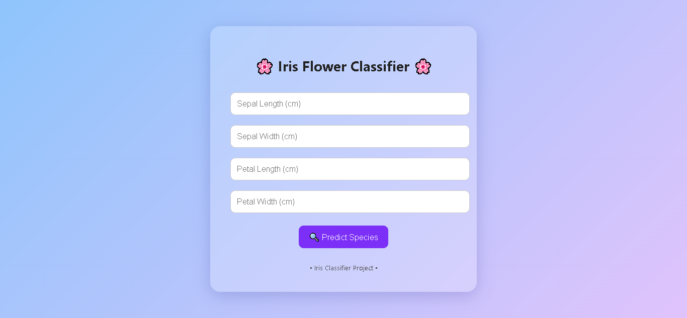

# 🌸 Iris Flower Classification AI Project (KNN Model)

This project is a simple yet effective Machine Learning application that classifies Iris flowers into one of three species—**Setosa**, **Versicolor**, or **Virginica**—based on their petal and sepal measurements. It uses the **K-Nearest Neighbors (KNN)** algorithm and provides a user-friendly web interface built with **Flask**.

---

## 🚀 Features

- Classifies iris flowers using sepal/petal length and width.
- Trained with **KNN (k=5)** for optimal accuracy.
- Web-based prediction form with beautiful glassmorphism UI.
- Achieved **100% accuracy** on the test set.
- Clean and responsive design.

---

## 🧠 Model Info

- **Algorithm**: K-Nearest Neighbors
- **Dataset**: [Iris Dataset from Kaggle](https://www.kaggle.com/uciml/iris)
- **Features**:
  - Sepal Length (cm)
  - Sepal Width (cm)
  - Petal Length (cm)
  - Petal Width (cm)
- **Target**: Species (`Setosa`, `Versicolor`, `Virginica`)

---

## 🛠️ Project Structure

```bash
├── app.py                     # Flask backend
├── knn_model.pkl             # Trained KNN model
├── scaler.pkl                # StandardScaler object
├── templates/
│   └── index.html            # Frontend HTML form
├── IrisFlowerClassification(KNN).ipynb  # Jupyter notebook with training and visualizations
└── IRIS.csv                  # Dataset file (not included here)
````

---

## 💻 How to Run Locally

### 📦 Requirements

* Python 3.x
* Flask
* scikit-learn
* numpy
* joblib
* pandas
* matplotlib
* seaborn

### 🧪 Installation

```bash
pip install flask scikit-learn numpy pandas matplotlib seaborn joblib
```

### 🏃 Steps to Run

```bash
# Step 1: Navigate to the project directory
cd path_to_your_project_directory

# Step 2: Run the Flask server
python app.py
```

Then open your browser and visit:
👉 `http://127.0.0.1:5000`

---

## 📊 Visualizations

* Confusion Matrix
* Classification Report Heatmap
* Error Rate vs. K Plot

These visualizations are available in the Jupyter notebook:
**IrisFlowerClassification(KNN).ipynb**

---

## 📷 Screenshots



---

## 👨‍💻 Authors

* **Zain Kashif**
* **Rahima Farrukh**

---

## 📚 References

* [Scikit-learn Documentation](https://scikit-learn.org/)
* [Kaggle - Iris Dataset](https://www.kaggle.com/uciml/iris)
* [Flask Documentation](https://flask.palletsprojects.com/)

---

## 📬 Feedback

Have suggestions? Open an issue or email us!

```

Let me know if you'd like help adding a license, badge, or GitHub Actions deployment instructions as well!
```
